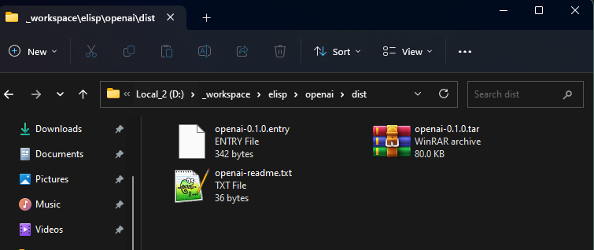

# Emacs Eask 101 - Build tool


I've developed more than 50 elisp packages, and maintain 100 or more of them.
Developing an elisp package isn't easy for a beginner, especially for those
who want to publish their package to an ELPA. e.g., [GNU Elpa][], [NonGNU Elpa][],
[MELPA][], etc.

That's why I use [Eask][] to help me develop elisp packages. Therefore, in this
article, I'm going to teach people how to use this tool to help you build your
own elisp packages! 😄

<!-- more -->

## 🗨️ Trouble using Eask

Eask now has more than 50 commands (including hidden ones). The tool is fairly
complex so the first thing you need to know is to use `--help` when have trouble
using this tool.

```sh
$ eask --help
```

## 📦 Build the package

Here we jump right into the package development. I assumed you already know
how to create Eask-file and want to use this tool effectively right a way.

I'm going to use an existing elisp package I've created [openai.el][openai]
just to show the workflow.

```sh
# Clone the project
$ git clone https://github.com/emacs-openai/openai.git

# Navigate to project directory
cd sideline

# (Optional) Print the folder structure
tree /f
```

The project structure looks like this:

```
│   .dir-locals.el
│   .gitignore
│   CHANGELOG.md
│   Eask
│   LICENSE.txt
│   Makefile
│   openai-audio.el
│   openai-chat.el
│   openai-completion.el
│   openai-edit.el
│   openai-embedding.el
│   openai-engine.el
│   openai-file.el
│   openai-fine-tune.el
│   openai-image.el
│   openai-model.el
│   openai-moderation.el
│   openai.el
│   README.md
│
└───.github
    └───workflows
            test.yml
```

We first build the package with:

```sh
$ eask package
```

This command will create a folder `dist`, and here is the result:



Noticed this is a [multi-file package][] so it's built into a `tar` file. If we
inspect the `tar` file, then this is the result:


## ⚙ Install it

Now you have created the package successfully, it means your package will have
no issue hosting on any `ELPA` ([GNU Elpa][], [MELPA][], etc.).
People can download your package on the ELPA you like to host. The next step
is to test installing the package. It's meaningless if people can download
your package but aren't able to install it. We install the package with
the `install` command:

```sh
$ eask install
```

The package is installed in an isolated environment, so it won't create any side
effects to your personal configuration `~/.emacs.d/`. Here is the result:


## 📋 Activate in runtime

The activation test is simple, we normally want to check if your package will
run correctly on your user's machine.

```sh
$ eask test activate
```

You should see the following output:

```sh
Loading package information... done v

Activating the package `openai'... succeeded v
(Nothing to load.)
```

Great! It means our package has been activated without any error! 😋

This step is generally optional, but it's good to know if you will encounter
any runtime errors!

## 👷 Compile it!

It's time to compile your package! Compile step is the same as the install step.
The only difference is it won't need to be built (`eask package`) to test
to see if your package will install correctly. Therefore, compile step is very
helpful since we don't always want to build the package for every change we
have made.

```sh
$ eask compile
```

And yes, it compiles successfully without any errors! 😋

```sh
Compiling d:/_workspace/elisp/openai/openai.el... done v
Compiling d:/_workspace/elisp/openai/openai-audio.el... done v
Compiling d:/_workspace/elisp/openai/openai-chat.el... done v
Compiling d:/_workspace/elisp/openai/openai-completion.el... done v
Compiling d:/_workspace/elisp/openai/openai-edit.el... done v
Compiling d:/_workspace/elisp/openai/openai-embedding.el... done v
Compiling d:/_workspace/elisp/openai/openai-engine.el... done v
Compiling d:/_workspace/elisp/openai/openai-file.el... done v
Compiling d:/_workspace/elisp/openai/openai-fine-tune.el... done v
Compiling d:/_workspace/elisp/openai/openai-image.el... done v
Compiling d:/_workspace/elisp/openai/openai-model.el... done v
Compiling d:/_workspace/elisp/openai/openai-moderation.el... done v

(Total of 12 files compiled, 0 skipped)
```

## ⚜️ Conclusion

These are the basic uses of [Eask][], but there are more things that Eask can
do. Like lint your package, run tests suite, or package management, etc. But
we can cover these within the next chapter.

This is the result of all the commands we have used in this article:

```sh
eask package        # Build package artifect (installable file)
eask install        # Install installable file
eask test activate  # Test package activation
eask compile        # Source code compilation
```

[GNU Elpa]: https://elpa.gnu.org/
[NonGNU Elpa]: https://elpa.nongnu.org/
[MELPA]: https://melpa.org/
[Eask]: https://github.com/emacs-eask/cli
[openai]: https://github.com/emacs-openai/openai
[multi-file package]: https://www.gnu.org/software/emacs/manual/html_node/elisp/Multi_002dfile-Packages.html

