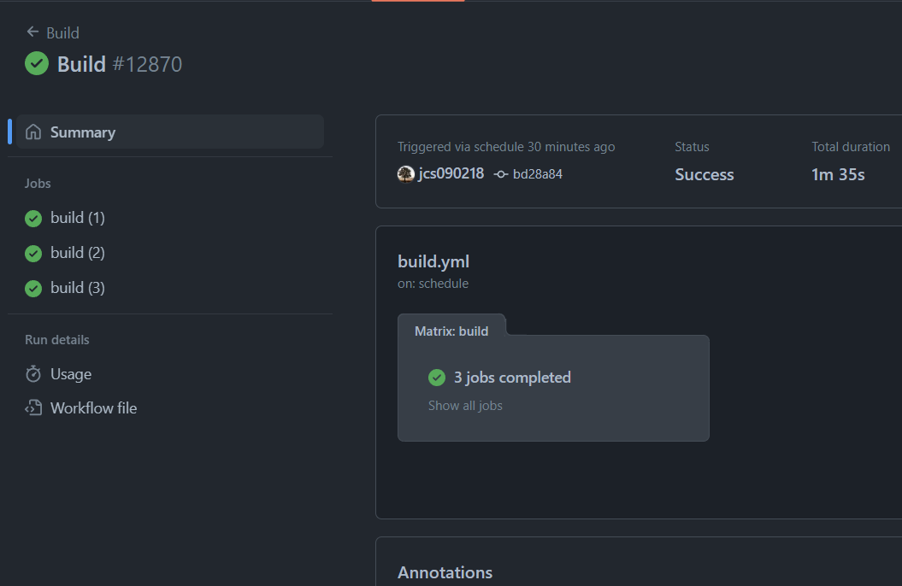

# Fastest ELPA


What's the fastest ELPA? Let's define it first! The ELPA runs the fastest? No,
that doesn't make any sense. The ELPA serves you the fastest? Maybe.

The definition for fastest ELPA in this article means it builds your packages
the fastest! You might wonder why and how! Let me explain it to you!

<!-- more -->

Normal ELPA, like MELPA, builds packages from the `recipes` directory, so it
takes O(n) to do so. The more packages one ELPA holds, take longer the time to
get packages to update to the server. The general solution is to use a more
powerful PC to reduce the build time.

Here comes [JCS-ELPA][], it uses the package [github-elpa][] to host packages
on the GitHub pages! But why is it the fastest LEPA? There are two factors:

1. Microsoft owns GitHub so technically we serve our ELPA on Microsoft's server
2. We build packages using [GitHub Actions][] with multiple jobs (if you are
unfamiliar with GHA, think as multiple PCs helping you build your packages)

JCS-ELPA builds your packages with multiple jobs simultaneously! Therefore,
in theory, JCS-ELPA is the fastest ELPA in this world!

But that's it! Nothing to brag about it! 😅

## 👷 How does it work?

> 💡 Here we only explain how it works sine there aren't enough packages to proof
> this ELPA is the fastest!

As of right now, there are only 136 packages hosted on JCS-ELPA. I have split
these recipes into smaller sections. Let's say 50 per section! The formula
will be:

```
jobs = (total recipes / recipes per section) + 1
```

Hence:

```
3 = (136 / 50) + 1
```

Now you have 3 workers to help you build packages onto our server! 😄



One of the coolest things is you can see what happens directly through the GHA's
log!

[JCS-ELPA]: https://jcs-emacs.github.io/jcs-elpa/
[github-elpa]: https://github.com/10sr/github-elpa
[GitHub Actions]: https://github.com/features/actions

