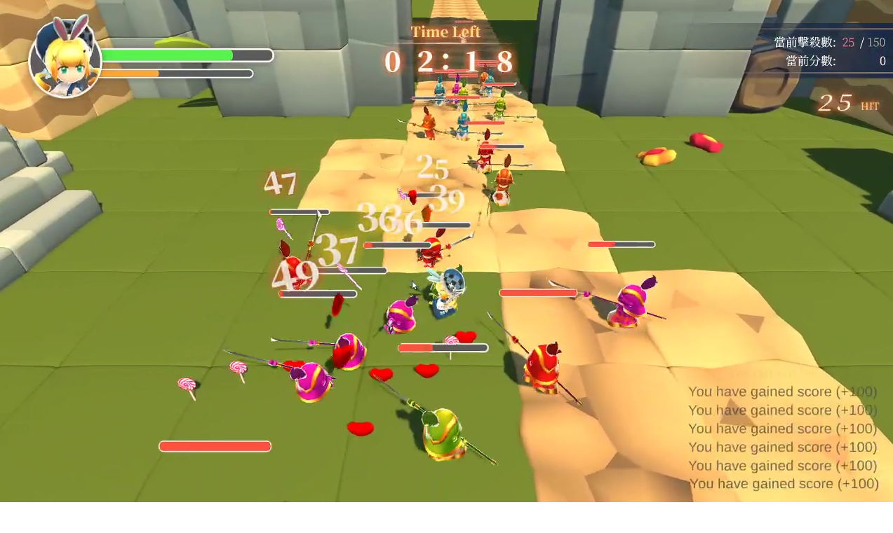
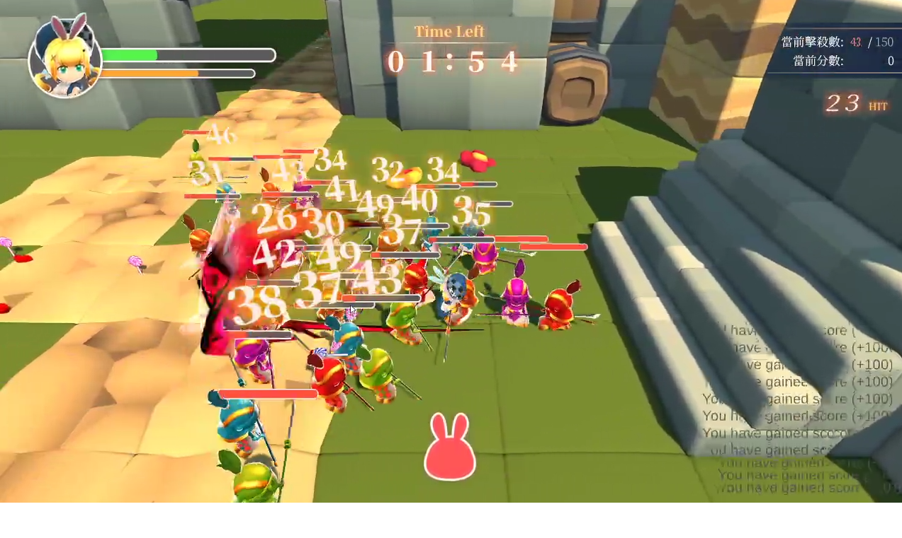

# Game Jam - Aug 2022

Timeline is placed in summer time, middle of July 2022, one of my friend
([@henrykuh](https://github.com/henrykuh)) invited me to join the Game
Jam that he is going to host in Aug 2022. In the meantime, he has also
invited me to rejoin the community [MatchWorkshop](https://github.com/MatchWorkshop)
, and become the headmaster of the Game Programming deparetment.
Therefore, this Game Jam is treated as an opportunity to collaborate
with other headmaster from other department in this community. 😕

I believe "networking" is a massive part of the Game Jam; hence I have
decided to join the event without too much hesitation. This Game Jam
came in just about the right time since I just ended another project
last month.

<!-- more -->

### ❓ About Game Jam

Game Jam's full name are [5th DIY Game Jam: Surprise](https://itch.io/jam/20220829).
This is hosted by [DIY GM](https://diygm2021.weebly.com/). Entire event
is about `1 month`, it's a lot longer compare to regular Game Jams due
to the COVID-19.

The theme is already announced through the title, `surprise`.

### 🔰 Joined! Meet the team

I was in the [MatchWorkshop]() community once a while ago, but we didn't
have time and a chance to get to know each other well. This is the right
time for me to network with other people who already have working
experience in Taiwan's Game Industry. Team and role are listed below:

- Kyrie （Game Desinger）
- Yi （3D Artist）
- 黑攻 （2D Artist、Composer）
- 特里斯卡 （2D Artist）
- Jen-Chieh Shen （Engineer）  **<- That's me! 😎**

### 💡 Design, and Programmer View

WIP

### 🖼️ Screenshots

### 💬 Conclusion

WIP

### 🔗 Links

- [Game: Alice In Surprise](https://kuhhenry.itch.io/alice-in-surprise)
- [Game Jam](https://itch.io/jam/2022082)
- [DIY GM](https://diygm2021.weebly.com/)
- [MatchWorkshop](https://github.com/MatchWorkshop)

