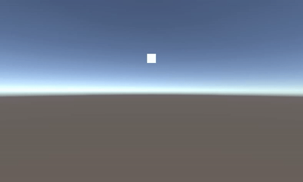
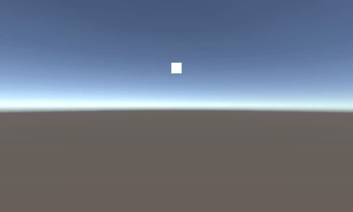
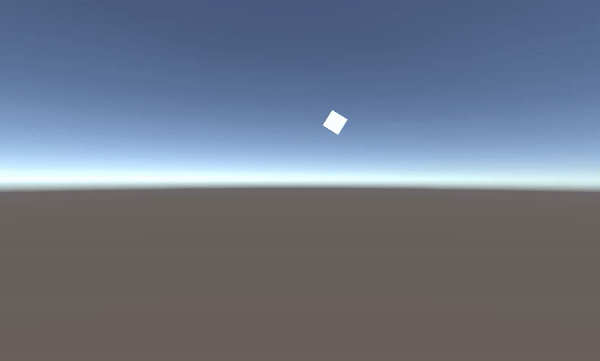
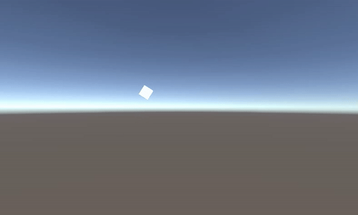
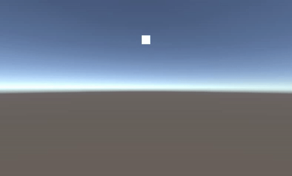

**JCSUnity Repo:** https://github.com/jcs090218/JCSUnity

## Acknowledge 前言

I have developed this tool for 3 years. Starting from the third year of my
college years. Compare to other framework I had developed, this tool have
much more completeness. I have been using Unity Engine for 2 years while I
decide to develop this framework. I have made cetain of games in this 2 years
and I reckon I gained enough experiences to develop a framework for Unity
Engine. In the retrospect, that was the time I have just done studying
"Data Structure", "Algorithms", "Design Patterns". What I presume that Design
Patterns are the vital part to a game development because game are often built
by multiple components or modules. What I meant multiple are refer as really a
lot of those. On the other hand, most software development would not requires
that many of the systems, generally the reasons are most of the environment
have been wrap or encapsulate by the former developers. For instances, .NET
Frameowrk, Visual BASIC/C++/C#, NetBean Graphic, etc.

這裡要介紹什麼其實真的不好說, 這是我已經開發將近3年的框架. 這個是我在大三的時候開發的框架, 也算是比較完整的框架.
在閱讀此篇之前,讀者最好要先了解框架,工具箱,圖書館,等等類似的東西的差別, 在這裡就不多贅述. 在我寫這個工具的時候,
我已經使用Unity大約兩年的時間. 從中做了不少的遊戲,畢竟課業需求,做遊戲如同家常便飯一樣. 寫程式也已經邁入第三年,
那時候的我才剛學完"資料結構","演算法","設計模式". 特別是設計模式, 對於遊戲開發是特別有用的. 因為大多軟體架構都
是非常小的, 不然就是已經被前人給包好了. 例如, .NET框架, Visual BASIC/C++/C#, NetBean Graphic, 等等.
但是遊戲不同, 遊戲的架構通常再怎麼包都是非常大且複雜的. 了解底層運作更是十八般武藝...

<!-- more -->

On top of these concepts, this is the third framework I built. I could not
remember what I built for the previous two framworks. I presume that I have
some knowledge about building a framework, library, etc. At the beginning of
the JCSUnity development process, I have had studied the basis of the game
engine architecture but not quite fully understand the Unity Engine itself.
For instance, Unity Engine's Scripting API, and some controls specific for
Unity Eninge. Because of this, you might realized some of the code or design
are a bit fiddle and inconsistent.

When I am writing this article, the framework itself has been developed to the
state that is convoluted and hard to maintain. Within this framework, there are
around 400 to 500 scripts, most of the scripts are self executed which mean a
script is a component that could run by it own. By this idea, one Self-Runnable
Script benefits the design and increase the variation possibility but it also
brings the cost of unnecessary performance.

在這些基礎之上,這個已經是我搭建的第三個框架,前面兩個我已經記不起來了. 我只記得其中一個是用AS3跟Starling框架配合.
對於寫API函式我已經算是有一定程度上的了解, 但是對於遊戲引擎的架構就有點顯得無知了. 在寫這個的時候我已經研究完了基
礎的遊戲引擎結構, 但是依然對於Unity Engine專門設計的API以及操作並不是很了解. 這使得我的工具顯得有點不是非常一致.
但是在我寫這個文章的時候, 這個工具已經大到非常難以管理的地步. 裡面的我自己寫的腳本大約400到500個. 每個腳本都是可以
獨立運行的,所以變化上由想可知是非常多的,同時也帶來了可能不必要的效能.

## Introduction 介紹

JCSUnity is a component driven framework built to allow users to quickly generate
commonly used game mechanics or features. The architecture design of JCSUnity
come alone to Unity Engine's design, which makes the framework highly compatible
with Unity Engine itself. Every time the Unity Engine release an update, there
should not be any issues to JCSUnity. This framework increases the productivity
of game developers and enhances the game development process. Base my own experiences,
the game originally that would spend my 15 weeks, I could compress development time
to around 3 to 4 weeks. JCSUnity has most of the game presets that Unity Engine does
not usually provide. For instance, switch scene with fade in and out, background music
player, automatically adjust the screen to aspect ratio, etc. With all these presets,
allow the game developers are more likely can be more focus on the design of the game
instead of worrying all these trivial features.

JCSUnity是一個可快速搭建自己遊戲成品的高完成度框架. 由於框架的設計符合
Unity引擎遊戲設計師的設計理念, 版本相容度是非常高的, 基本上每次的Unity
版本升級都不會有問題. 這個框架更是完美呈現了框架的用意, 框架能提升開發者
的產能(productivity). 本人原本需要開發15周的時間能壓縮到3周, 因為這個
框架擁有了大多數遊戲都需要的設置, 但是Unity引擎本身並沒有提供的設置. 例
如, 慢慢地切換場景, 切換背景音樂, 銀幕等比例相容, 等等. 這個框架能讓遊戲
開發者高度集中在遊戲核心上的開發, 進而發展更多好玩的遊戲.

## Self-Runnable Script 可獨立運行腳本

Therefore, what is Self-Runnable Script? For example, here is a list of three SRSs.

接著上面所說的, 什麼是可獨立運行的腳本呢? 比如我有三個腳本,

<table>
  <tr>
    <td>1.</td>
    <td>Circle Action (繞圓圈行為)</td>
  </tr>
  <tr>
    <td>2.</td>
    <td>Shake Effect (震動效果)</td>
  </tr>
  <tr>
    <td>3.</td>
    <td>Wave Action (上下搖擺效果)</td>
  </tr>
</table>

Above example scripts are all self-runnable without any dependencies and 
will not influence to each other scripts. Base on this design patterns, 
how many unique behaviours if we make all these scripts interact with each other?

這三個腳本都能夠獨立運行並且互不干擾運作, 就是<b>能獨立運行腳本</b>. 那
這三個腳本總共會有多少的變化呢? 總共<b>7</b>種. 公式如下:

```
7 behaviours = 3 basic behaviours +
               (Circle Action + Shake Effect) +
               (Circle Action + Wave Action) +
               (Shake Effect + Wave Effect) +
               (Circle Action + Shake Effect + Wave Action)
```

```
7種行為變化 = 本身3種 +
             (繞圓+震動) +
             (繞圓+上下搖擺) +
             (震動+上下搖擺) +
             (繞圓+震動+上下搖擺)
```

I presume if anyone who has the necessary knowledge about game engine architecture. 
Design the components this way could avoid decoupling between the scripts, and 
added the flexibility to the designers. Designers are no longer limit to specific 
design; they can test and play with each component easily. The side effects are 
this could cost a lot of additional performance and memory usage.

如果了解引擎架構的人大概都會選擇這樣的想法, 這樣能夠避免耦合(decoupling)
. 也能夠讓設計師們隨時隨地的使用來搭配它們自己想要的效果. 可以減輕不少程
式設計師的工作負荷. 缺點則顯而易見, 就是沒辦法最大化的提升效能. 至於為什
麼等下會提到.

<div style="text-align: center">
  
  
  
  <h4>3 Basic Actions 本身3種</h4>

  
  
  
  <h4>(Circle Action 繞圓 + Shake Effect 震動) + (Circle Action 繞圓 + Wave Action 上下搖擺) + (Shake Effect 震動 + Wave Effect 上下搖擺)</h4>

  
  <h4>(Circle Action 繞圓 + Shake Effect 震動 + Wave Action 上下搖擺)</h4>
</div>


## Scripting Design 腳本上的設計

Having the script design this way, there should be a script principle so 
people could contribute or extend to the project easier. I chose to use 
'Header' attribute to accomplish this task and here are the definition of 
all the terminology in JCSUnity.

腳本上要求這樣高自由度, 難免會需要一個共同的規範. 畢竟不可能所有的一個
獨立運行腳本就有一個自己的規範, 那不就天下大亂了? 我選擇善加使用Header屬性,
再加上一些自己規定的專有名詞來達成這項任務.

```cs
#if UNITY_EDITOR

    [Header("** Helper Variables (JCS_ExampleScript) **")]

    /// -<-summary->-
    /// Variable only happens in developer mode, so it won't exist in the final build. Usually the helper tool in for level designer.
	///
	/// 這是個幫助你在環境中測試的變數. 注意! 這個並不會出現在你的實際遊戲之中.
    /// -<-/summary->-
    float helperVar = 0.0f;

#endif


    [Header("** Check Variables (JCS_ExampleScript) **")]

    /// -<-summary->-
    /// Variable only for checking, do not adjust the value of the variables, but you can use to check to see the effect during runtime.
	///
	/// 只拿來看的, 請勿直接操作!
    /// -<-/summary->-
    float checkVar = 0.0f;


    [Header("** Initialize Variables (JCS_ExampleScript) **")]

    /// -<-summary->-
    /// Variable only being use in game initialize time, set these kind of variable before hitting play button in order to get the result.
	///
	/// 只有在遊戲初始化階段受到影響.
    /// -<-/summary->-
    float initVar = 0.0f;


    [Header("** Runtime Variables (JCS_ExampleScript) **")]

    /// -<-summary->-
    /// Variable will work on both initialize time and runtime, you can adjust the variable during runtime and see the effect.
	///
	/// 遊戲運行階段會受到影響.
    /// -<-/summary->-
    float rtVar = 0.0f;
```

For more information, you can click [here](https://jcs090218.github.io/JCSUnity/Manual/index.html?page=Naming_sp_Manual)!

官方說明請看, [這裡](https://jcs090218.github.io/JCSUnity/Manual/index.html?page=Naming_sp_Manual).

## Using 'JCS_' Filename, not Namespace 使用 JCS_ 檔名,不使用Namespace

In the early version of Unity, when I try to have the same file name in the 
project, it occurs error. To address this issue, I chose to have a particular 
file name prefix in front of every file in the project, which is 'JCS_'.

這個原因其實出奇的簡單, 在早期的Unity版本不接受同名稱檔案. 為了相容所有可能
的專案, 只能選擇在檔案名動手腳.
