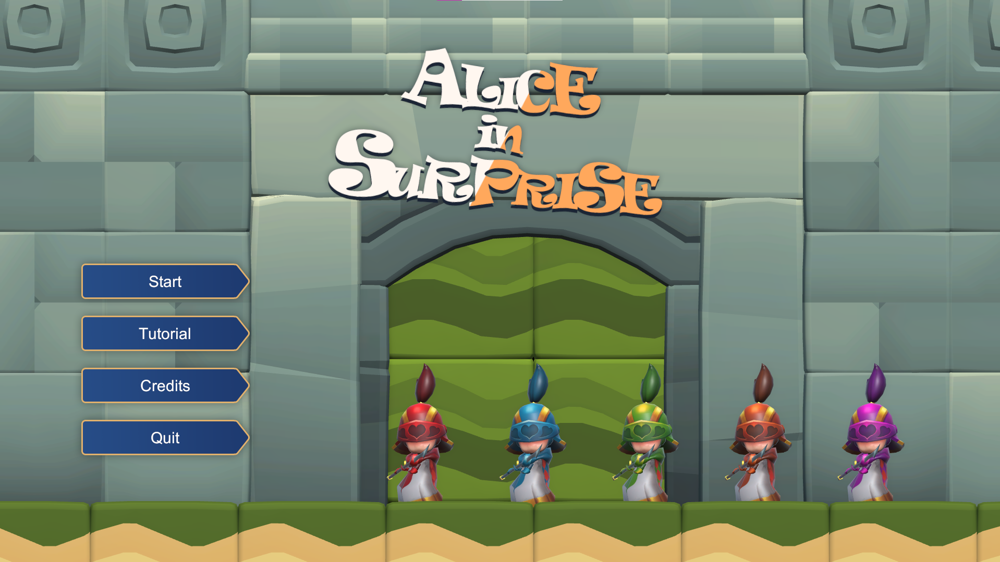

# Game Jam - 8月 2022

時間為2022的夏季, 在7月中旬, 我一位大學朋友 ([@henrykuh](https://github.com/henrykuh))
邀請我一同參與他所主辦的 Game Jam, 在其活動的主題為`驚喜 Surprise`. 同時他也邀請我回 [火柴共作坊](https://github.com/MatchWorkshop)
擔任`程式區塊的負責人`. 所以實質上, 這個 Game Jam 是用來讓我與其他在同個社群裡面的指導員
互相熟識, 以及交流的一個媒介. 這時候的我, 剛好完成了我上一份專案的開發計畫, 在沒有其他特別安排的
時期, 所以也沒有推辭, 就此決定參加很久沒參加的 Game Jam.

<!-- more -->

### ❓ 關於Game Jam

這個 Game Jam 的全名為 [第五屆 DIY Game Jam: 驚喜 Surprise](https://itch.io/jam/20220829).
主辦單位為 [自製遊戲公會](https://diygm2021.weebly.com/). 時間是`一個月`, 比一般的 COVID-19
前的 Game Jam 的時間來的長上許多. 以往 Game Jam 時間都是 `24 - 48 小時`, 也就是一到兩天的時間
限制. 這是這個 Game Jam 相對比較特別的地方.

因為本人不是第一次參加了, 所以為了保持公正性, 我自己不打算在這 Game Jam 花超過 24 小時.
不過還是會在這一個月, 視情況的對工作量進行合適的安排.

主題很明顯的, 名稱已經洩漏了, 是`驚喜`.

### 🔰 加入! 認識團隊

雖然以前我也曾短暫的待過在這 [火柴共作坊]() 社群, 但對於其成員並不熟識. 所以這對我是個好時機
來建立一下人派. 並且可以順便訓練溝通/協作的能力. 團隊為`5`人成員, `1`名企劃, `3`名美術,
`1`名程序. 列表如下:

- Kyrie （企劃）
- Yi （3D美術）
- 黑攻 （2D美術、音樂）
- 特里斯卡 （2D美術）
- Jen-Chieh Shen （程式）

## 成品展示

### 🔗 Links

- [作品: Alice In Surprise](https://kuhhenry.itch.io/alice-in-surprise)
- [Game Jam](https://itch.io/jam/2022082)
- [自製遊戲公會](https://diygm2021.weebly.com/)
- [火柴共作坊](https://github.com/MatchWorkshop)

